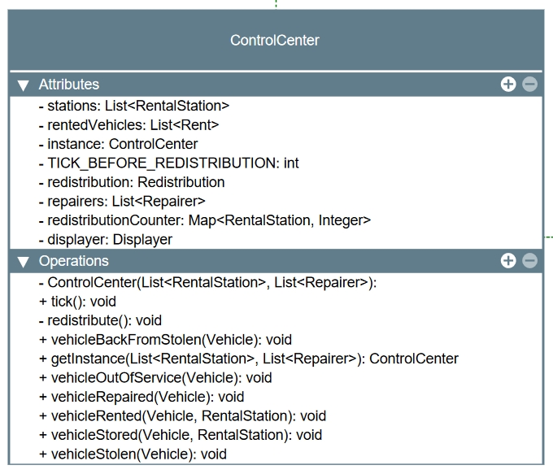
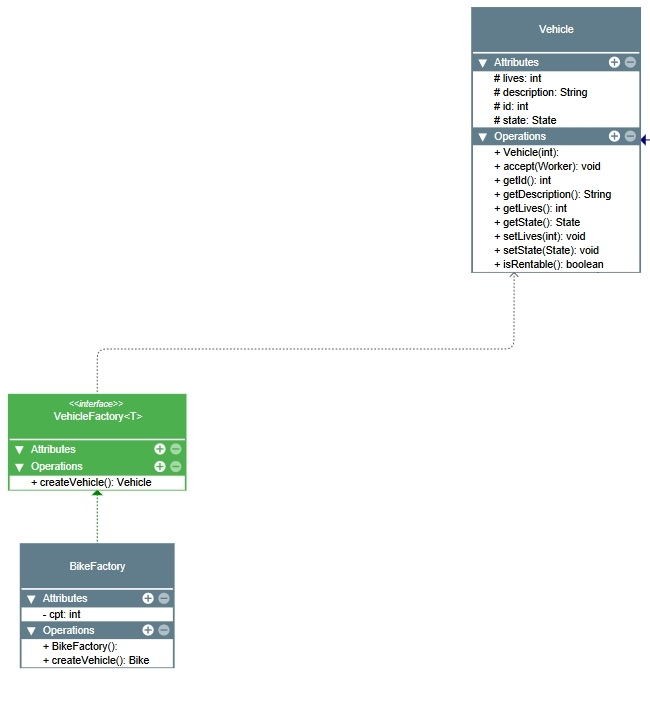
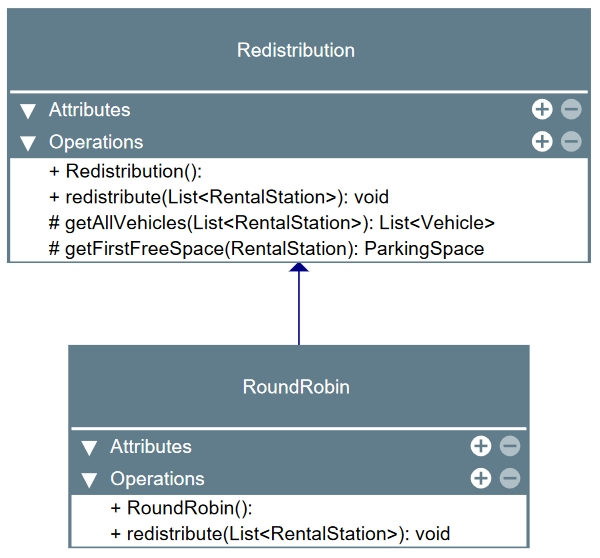
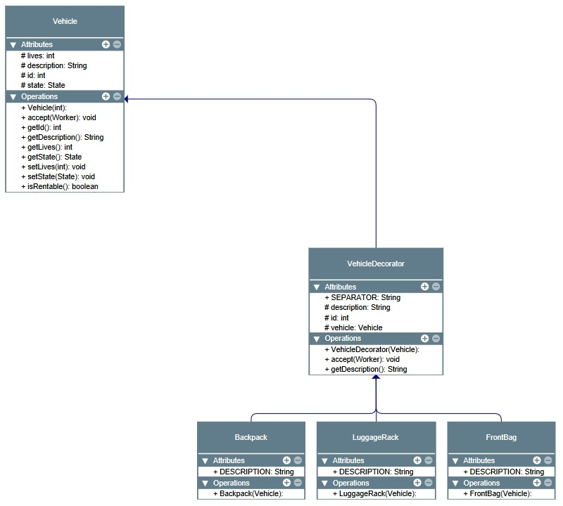
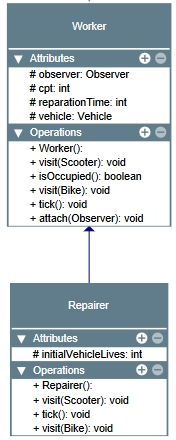
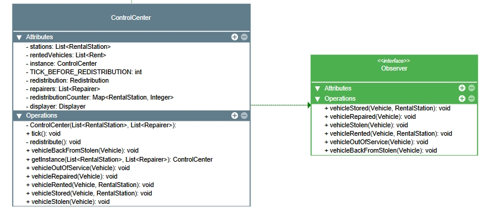

## Projet

### Commandes :
Le projet a été réalisé avec Maven.

Pour compiler le programme :
```bash
make compile
```

Pour executer les tests : 
```bash
make test
```

Pour executer le programme avec un temps de 30 secondes : 
```bash
make run
```

et pour executer le programme instantanément : 
```bash
make runInstantly
```

Nous avons utilisé la méthode du mutation testing, pour accéder aux résultats de ces mutations :
```bash
make mutation
```
et aller dans le dossier "/target/pit-reports/"

Pour générer la documentation :
```bash
mvn javadoc:javadoc
```
et aller dans le dossier "/target/site/apidocs/"

### Réalisation du projet

Voici la liste des design patterns utilisés dans le projet :
- Singleton
- Factory Method
- Strategy
- Decorator
- Visitor
- Observer

#### Explication des patterns :
Singleton : Dans le projet, on a un centre de contrôle, il gère les stations et les redirections, il a donc un rôle central dans le projet. Il n'en existe qu'un, il est donc évident qu'il soit un singleton et qu'on ne l'intancie qu'une seule fois.



<br/>
Factory Method : Ici la factory method est utilisé pour créer facilement différents types de véhicules.



<br/>
Strategy : Le stratégie pattern est utilisé ici pour les redistributions, on peut donc imaginer n'importe quel type de redistribution facilement et changer quel type de redistribution utiliser dans le control center. On peut aussi dire que le displayer est une stratégie d'affichage même si nous avons implémenter un seul displayer.



<br/>
Decorator : Le décorateur est utilisé pour ajouter des accessoires permanents aux véhicules.



<br/>
Visitor : Le visiteur est ici utilisé sur les travailleurs (Worker) qui vont effectuer différentes actions sur les différents types de véhicules. On peut créer autant de sous-classes de Worker, ici on n'a que le repairer qui va réparer les véhicules mais il est simple de proposer d'autres actions grâce au pattern visiteur.



<br/>
Observer : Le control center observe les stations afin d'être notifié quand il y a des actions dans les stations.



### Précisions :
Pour ce qui est de la simulation, nous n'avons pas développer les tests car nous avons jugé qu'elle était en dehors du projet et qu'elle permet juste de voir le fonctionnement et la logique derrière. Les tests du displayer n'ont pas été développés avec les mutations car on a juste des appels directement de ses fonctions qui sont juste des affichage dans la console. Toutes les autres classes ont été testées.

Pour pouvoir tester le singleton, la méthode de la Reflection à été utilisée car tout ses attributs étaient privés.

Nous avons essayé de respecter le plus possible les différents principes de conception (SOLID, DRY, KISS...).